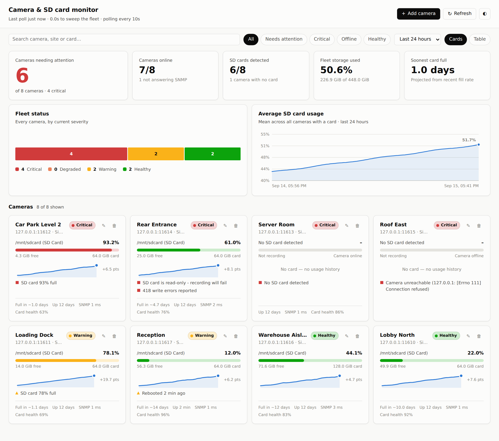

# camwatch — camera & SD card monitoring over SNMP

A dashboard that polls IP cameras over SNMP and tells you, at a glance, which
ones have an SD card problem: full, missing, read-only, wearing out, or a camera
that has stopped answering altogether.



**No dependencies.** No `pip install`, no `npm install`, no build step. The SNMP
client, the HTTP server and the charts are all written against the Python
standard library, because a monitoring tool you can't start is worse than no
monitoring tool. Python 3.9+ is the only requirement.

## Try it in 30 seconds

```bash
./demo.sh
```

That starts a simulated fleet of eight cameras (healthy, filling up, nearly
full, card missing, card read-only, offline, recently rebooted), backfills some
history so the charts have something to draw, and serves the dashboard at
http://127.0.0.1:8080/. No real hardware involved.

## Add your real cameras

### The easy way — from the dashboard

Click **Add camera**, type the IP, and press **Test connection**. It polls the
camera there and then and tells you what it found:

- *Camera found — /mnt/sdcard (SD Card) at 44.4% of 128.0 GiB* → press Add.
- *Answered, but no SD card was detected* → a dropdown appears listing the
  camera's actual volumes, so you can pick the right one.
- *No SNMP response* → it tells you what to check.

Saving writes to `cameras.json` and polls the new camera immediately, so it
appears on the dashboard within a second. Each card gets edit (✎) and remove
(🗑) buttons too.

Editing is enabled automatically when the server is bound to localhost (the
default). It's **off** when bound to anything else, because these endpoints
write to disk and there is no authentication — pass `--allow-config-edits` to
override that on a network you trust.

### Or work out the settings first

`tools/probe.py` answers "will this work with my camera, and which volume is
the SD card?":

```bash
python3 tools/probe.py 192.168.1.41                 # probe one camera
python3 tools/probe.py --scan 192.168.1.0/24        # find SNMP devices first
```

It tries `public` then `private`, and v2c then v1, unless you pin them with
`--community` / `--version`. Output:

```
✓ 192.168.1.41:161 answered SNMP v2c in 4 ms

  sysName   Lobby North
  sysDescr  Catalyst C500 Dome Camera; firmware 4.2.1; Linux 5.10

HOST-RESOURCES-MIB storage table
     IDX  DESCRIPTION                              SIZE   USED  TYPE
  ------------------------------------------------------------------------
       1  Physical memory                     512.0 MiB    61%  RAM
       2  / (root filesystem)                 256.0 MiB    77%  fixed disk
  →    3  /mnt/sdcard (SD Card)                64.0 GiB    22%  removable disk

✓ SD card detected via hrStorage
    14.1 GiB used of 64.0 GiB (22.0%)

Config entry — paste into the "cameras" list in cameras.json:

    {
      "id": "cam-lobby-north",
      "name": "Lobby North",
      "host": "192.168.1.41"
    }
```

The `→` marks the row camwatch picked. If it picked wrong, the table gives you
the index to pin with `sd_storage_index`. Exit status is 0 when a card was
found, so it also works as a check in a script.

### Or edit the file by hand

```bash
cp cameras.example.json cameras.json
$EDITOR cameras.json                  # set hosts + community strings
export SNMP_COMMUNITY='your-community'

python3 -m camwatch.server --config cameras.json --once   # check it works
python3 -m camwatch.server --config cameras.json          # serve the dashboard
```

`--once` polls every camera, prints a table and exits — the fastest way to
confirm your community string and OIDs are right before leaving it running:

```
CAMERA                STATUS    SD CARD                       SIZE   USED  ISSUES
-------------------------------------------------------------------------------------------
Lobby North           good      /mnt/sdcard (SD Card)     64.0 GiB    22%
Loading Dock          warning   /mnt/sdcard (SD Card)     64.0 GiB    79%  SD card 79% full
Car Park Level 2      critical  /mnt/sdcard (SD Card)     64.0 GiB    94%  SD card 94% full
Server Room           critical  -                                -      -  No SD card detected
Rear Entrance         critical  /mnt/sdcard (SD Card)     64.0 GiB    61%  SD card is read-only…
Roof East             critical  -                                -      -  Camera unreachable…
-------------------------------------------------------------------------------------------
7/8 online, 6 need attention
```

`--once` records its sample to the database too, so running it from cron builds
the history that the trend chart and the days-until-full projection need. Pass
`--no-store` to suppress that.

Useful flags: `--host 0.0.0.0` to expose it on the LAN, `--port`, `--open` to
launch a browser, `-v` for per-poll debug logging.

## How SD card detection works

An agent hands back a storage table with RAM, the root filesystem and (with
luck) the card all mixed together. Picking the wrong row is worse than
reporting nothing — a root filesystem at 96% would page someone about a card
that's fine — so `camwatch` tries these in order:

1. **`sd_size_oid` + `sd_used_oid`** from the camera's config entry, if set.
   This is the escape hatch for vendor private MIBs (Axis, Hikvision, Dahua and
   friends all have one).
2. **HOST-RESOURCES-MIB `hrStorageTable`** (`1.3.6.1.2.1.25.2.3.1`). The generic
   path, and the one most embedded-Linux cameras use. Within it:
   - an explicit `sd_storage_index` wins if you set one;
   - otherwise the row whose description matches an SD pattern
     (`/mnt/sd`, `sdcard`, `mmcblk`, `removable`, …), most specific first;
   - otherwise the largest row typed `hrStorageRemovableDisk`.
   - RAM/virtual-memory rows and volumes under 64 MiB never qualify, and
     `swap`/`tmpfs`/`/proc` rows are excluded by name.
3. **UCD-SNMP-MIB `dskTable`** (`1.3.6.1.4.1.2021.9.1`), for older net-snmp
   builds where someone configured `disk /mnt/sd` explicitly.

If auto-detection picks the wrong volume, run `--once -v` to see what the
camera actually reports, then pin it with `sd_patterns` or `sd_storage_index`.

## What counts as a problem

| Condition | Severity | Why |
|---|---|---|
| Camera doesn't answer SNMP | **Critical** | In practice it isn't recording, and you can't tell |
| No SD card detected | **Critical** | Nothing is being written locally |
| Used ≥ `capacity_critical_percent` (90%) | **Critical** | About to stop recording, or already overwriting |
| Card reports read-only | **Critical** | Recording will fail silently |
| Write errors / allocation failures | **Degraded** | Flash is wearing out — still recording, but on its way out |
| Vendor card health ≤ 50% / ≤ 20% | **Degraded / Critical** | Wear-levelling reserve running down |
| Used ≥ `capacity_warning_percent` (75%) | **Warning** | Worth scheduling |
| Uptime < `recent_reboot_seconds` (15 min) | **Warning** | Repeated reboots are a classic symptom of a card the firmware can't write to |

Worst wins, but every condition is still listed on the camera's card. All
thresholds live under `thresholds` in the config.

`camwatch` also fits a least-squares line through each card's recent usage to
project **days until full**. It deliberately returns nothing when the card is
flat, shrinking, has under an hour of history, or is more than ~60 days out —
past that the extrapolation is fiction.

## Configuration

See `cameras.example.json` for a commented example. The essentials:

```jsonc
{
  "poll_interval_seconds": 60,
  "thresholds": { "capacity_warning_percent": 75, "capacity_critical_percent": 90 },
  "defaults": { "community": "${SNMP_COMMUNITY}", "version": "v2c" },
  "cameras": [
    { "id": "cam-lobby", "name": "Lobby North", "host": "192.168.1.41" }
  ]
}
```

`defaults` is merged into every camera, so shared settings are written once.
`${VAR}` anywhere in a string pulls from the environment — keep community
strings out of the file and out of git. A camera with `"enabled": false` stays
in the config but is not polled.

Per-camera overrides: `port`, `community`, `version`, `timeout`, `retries`,
`site`, `tags`, `sd_patterns`, `sd_storage_index`, `sd_size_oid`,
`sd_used_oid`, `sd_status_oid`, `sd_health_oid`, `sd_write_errors_oid`.

## API

The dashboard is a client of a plain JSON API, so you can wire the same data
into whatever you already run.

| Endpoint | Returns |
|---|---|
| `GET /api/fleet?hours=24` | Every camera's current status, a sparkline series, and the fleet summary |
| `GET /api/cameras/<id>` | One camera's current status |
| `GET /api/cameras/<id>/history?hours=24` | That camera's usage history |
| `GET /api/history?hours=24` | Fleet-average usage, bucketed for the trend chart |
| `GET /api/events?limit=50` | Recent severity transitions |
| `GET /api/health` | Liveness — `503` if the poll loop has stalled |
| `POST /api/refresh` | Ask the poller to sweep now |
| `POST /api/cameras/test` | Probe a camera without saving it |
| `POST /api/cameras` | Add a camera |
| `PATCH /api/cameras/<id>` | Update a camera (send `null` to clear a field) |
| `DELETE /api/cameras/<id>` | Remove a camera (its history is kept) |
| `POST /api/reload` | Re-read `cameras.json` from disk |

The last five write to `cameras.json` and are gated — see the note above. They
return `403` when editing is disabled and `400` with a human-readable `error`
when the submitted entry is invalid.

Edits go through the raw JSON, never a parsed config, so a `${VAR}` community
string stays a placeholder in the file rather than being written out expanded.
Writes are atomic and validated by re-parsing first, so a rejected edit leaves
the file byte-for-byte untouched.

`/api/health` is designed to be pointed at by an uptime checker: it fails when
polling stops, which is the failure mode a camera dashboard is worst at
noticing about itself.

## Architecture

```
camwatch/
  ber.py       ASN.1 BER encode/decode - the subset SNMP needs
  snmp.py      SNMP v1/v2c over UDP: GET, GETNEXT, GETBULK, walk
  mibs.py      OIDs, and the rules for recognising an SD card
  config.py    cameras.json loading + validation
  poller.py    varbinds -> CameraSample (incl. the pick-the-right-volume logic)
  health.py    severity rules and the days-until-full projection
  store.py     SQLite history + the in-memory "right now" view
  server.py    poll loop, JSON API, static file serving
web/           the dashboard (no framework, no build step)
tools/
  probe.py         probe/scan for cameras and show how to configure them
  fake_camera.py   an SNMP agent that impersonates a fleet of cameras
  seed_history.py  backfill plausible history for a demo
```

Cameras are polled concurrently on a thread pool — SNMP polling is almost
entirely waiting on the network — while the HTTP layer serves from memory, so
one hung camera never delays a dashboard request.

## Tests

```bash
python3 -m unittest discover -s tests
```

168 tests, no network access beyond loopback. The integration tests run the
real client against the simulator over real UDP sockets, including a
packet-loss test that checks retries ride out a lossy link instead of reporting
a false outage, and a test that a `${VAR}` community string is never written
back to disk expanded.

## Limitations

- **SNMPv3 is not supported.** v3's authPriv needs AES/DES, which the standard
  library doesn't ship, and adding it would mean a dependency. v1/v2c covers the
  read-only community-string setup cameras are almost always deployed with. A
  `v3` in the config is rejected with a clear message rather than silently
  downgrading.
- **Community strings are sent in clear text** — that's SNMP v1/v2c, not this
  tool. Keep polling on a management VLAN and use a read-only community.
- The dashboard has **no authentication**. It binds to `127.0.0.1` by default;
  if you use `--host 0.0.0.0`, put it behind something that does authenticate.
  Camera editing is disabled automatically in that case (`--allow-config-edits`
  overrides it) — but that gate is a guard rail, not a security boundary.
- Write-error counts come from `hrStorageAllocationFailures` or a vendor OID.
  Plenty of cameras report neither, in which case that column stays at zero —
  absence of errors here is not evidence the card is healthy.
